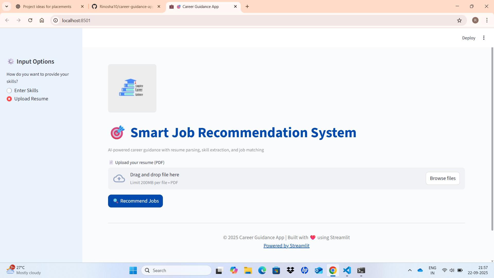
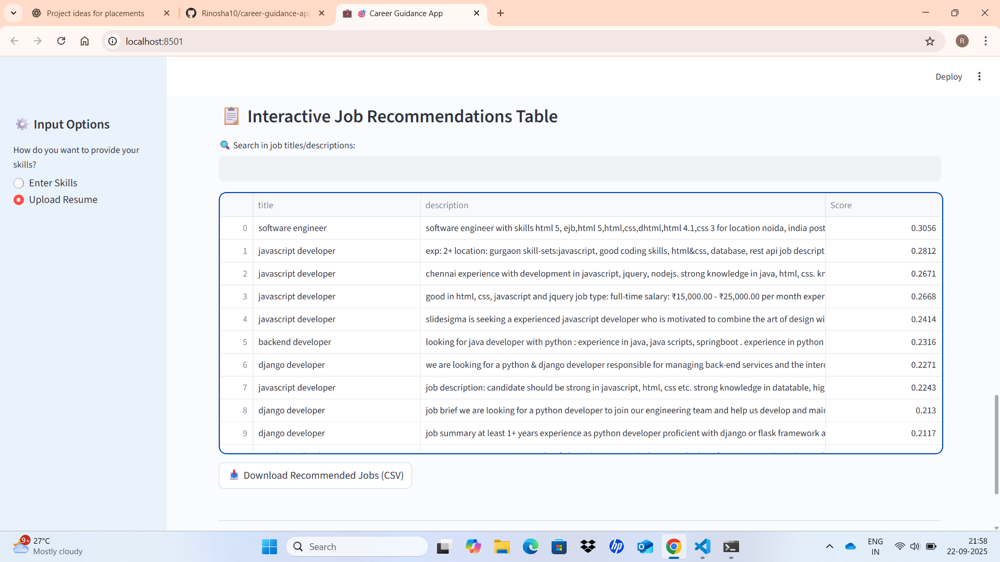

# 🎯 Smart Job Recommendation System  

AI-powered career guidance with resume parsing, skill extraction, and job matching.  

## 🚀 Live Demo  
Try the app here: [Career Guidance App](https://career-guidance-app-6bvofffq5wdspbaecebuhp.streamlit.app/)  

---

## 📖 Project Overview  

This project is a **Career Guidance App** built with **Streamlit**.  
It helps users by:  
- Extracting skills from resumes (PDF).  
- Matching them with job descriptions.  
- Recommending top job roles based on similarity.  
- Visualizing skill demand using charts.  

---

## ⚡ Features  

✅ Upload resume (PDF) or manually enter skills  
✅ Automatic skill extraction from resumes  
✅ Job recommendation system (based on similarity scores)  
✅ Skill demand visualization with interactive charts  
✅ Download extracted skills & recommended jobs  
✅ Filters for job search and industry type  
✅ Deployed on **Streamlit Cloud** for free access  

---

## 🛠️ Tech Stack  

- **Python**  
- **Streamlit** (Frontend + Hosting)  
- **Pandas** (Data Handling)  
- **scikit-learn** (Similarity / Recommendation logic)  
- **Plotly** (Charts & Visualizations)  
- **PyPDF2** (Resume text extraction)  

---

## 📂 Project Structure  

📦 CGP
┣ 📜 app.py # Main Streamlit app
┣ 📜 recommend_jobs.py # Job recommendation logic
┣ 📜 requirements.txt # Dependencies for the project
┣ 📜 roles_clean.csv # Job dataset (cleaned)
┣ 📜 skills_list.txt # Skills database
┣ 📜 logo.jpg # App logo
┣ 📜 README.md # Project documentation
┗ 📂 screenshots/ # Screenshots of the app

yaml
Copy code

---

## 🖼️ Screenshots  

### 🏠 Home Page  
  

### 📄 Upload Resume  
  

### 💼 Job Recommendations  
  

### 📊 Skill Demand Visualization  
  

### 📋 Interactive Table  
  

---

## 🚀 Deployment  

This app is deployed on **Streamlit Cloud**.  

Steps followed:  
1. Pushed project files to GitHub.  
2. Created `requirements.txt` for dependencies.  
3. Connected GitHub repo to Streamlit Cloud.  
4. Selected `app.py` and clicked **Deploy**.  

✅ Free hosting with a shareable link.  

---

## 🙌 Contributing  

Contributions are welcome! Feel free to:  
- Open issues  
- Submit pull requests  
- Suggest new features  

---

## 📜 License  

This project is licensed under the **MIT License** – you’re free to use, modify, and distribute it.  

---