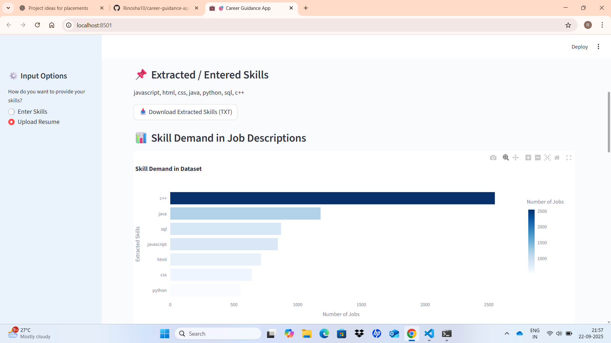
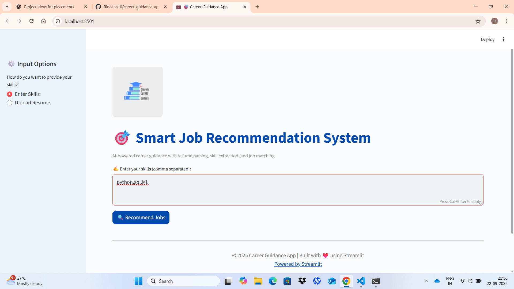

# 🎯 Career Guidance App

An AI-powered job recommendation system that helps you find the most relevant career opportunities based on your **skills** or **resume**.

---

## 🚀 Features
- 📄 Resume parsing (PDF upload)
- 🛠️ Automatic skill extraction
- 📊 Skill demand visualization
- 💼 Job recommendations with similarity score
- 🔍 Search & filter options
- 📥 Export results to CSV
- 🖼️ Screenshots included below

---

## 🖼️ Screenshots

### 🔹 Home Page


### 🔹 Upload Resume


### 🔹 Job Recommendations


### 🔹 Search & Filter


### 🔹 Interactive Table


---

## ⚙️ Installation

Clone the repo and install dependencies:

```bash
git clone https://github.com/your-username/career-guidance-app.git
cd career-guidance-app
pip install -r requirements.txt
